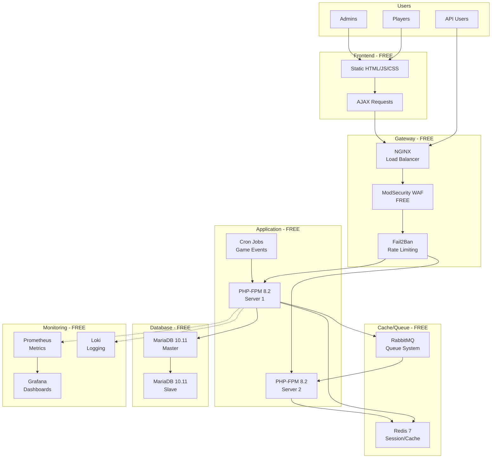
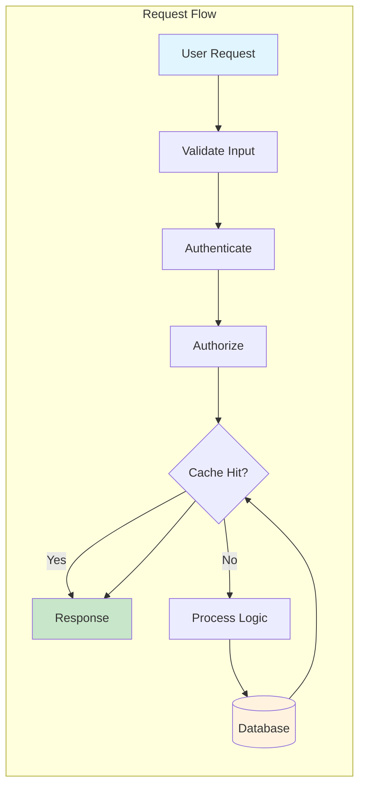
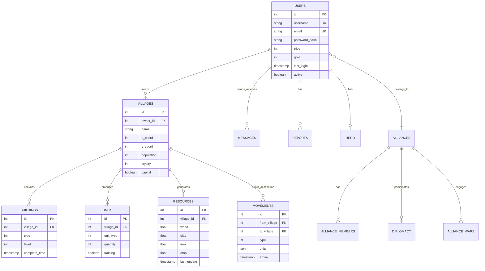
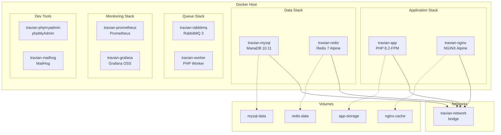
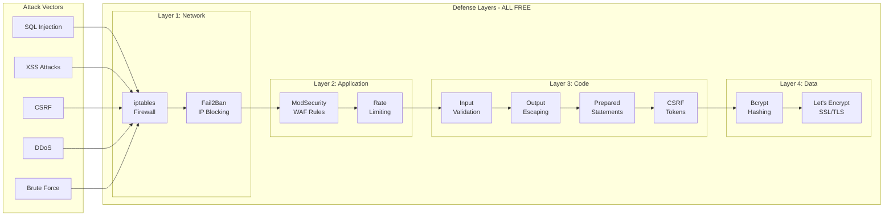
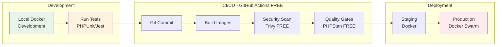
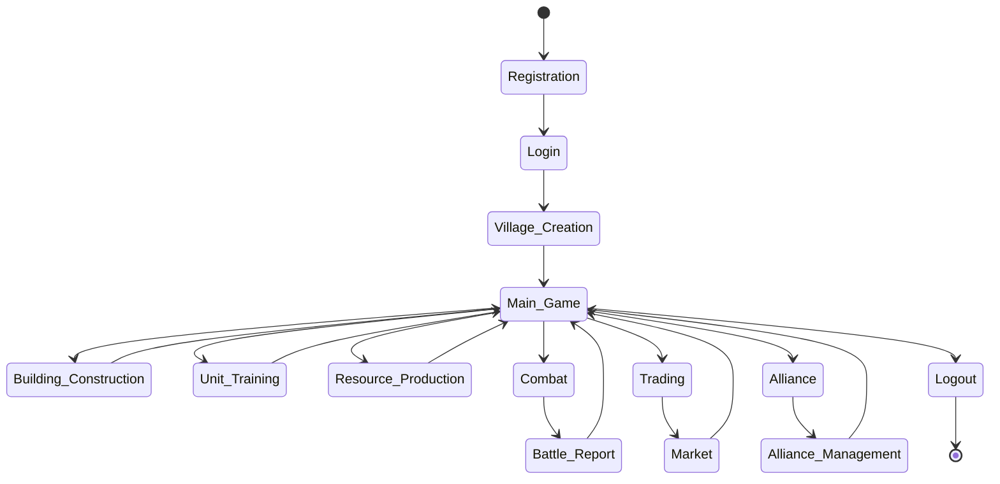
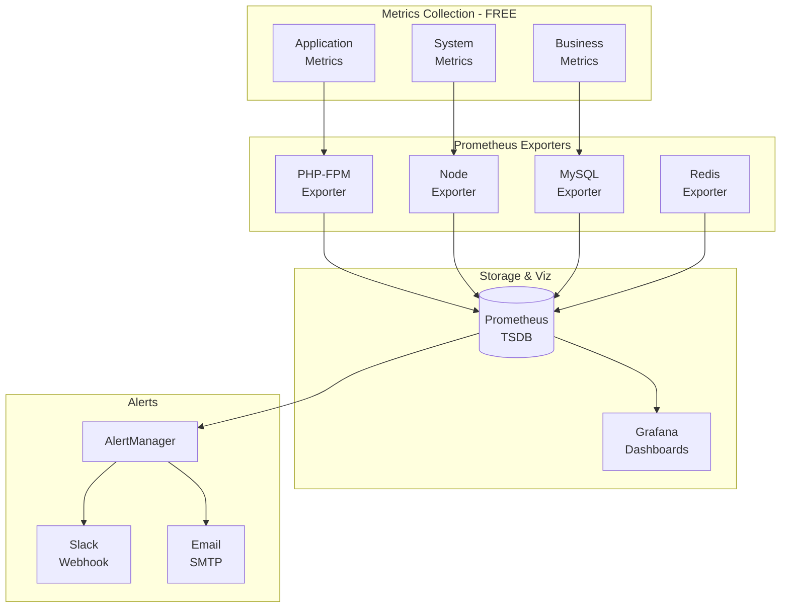
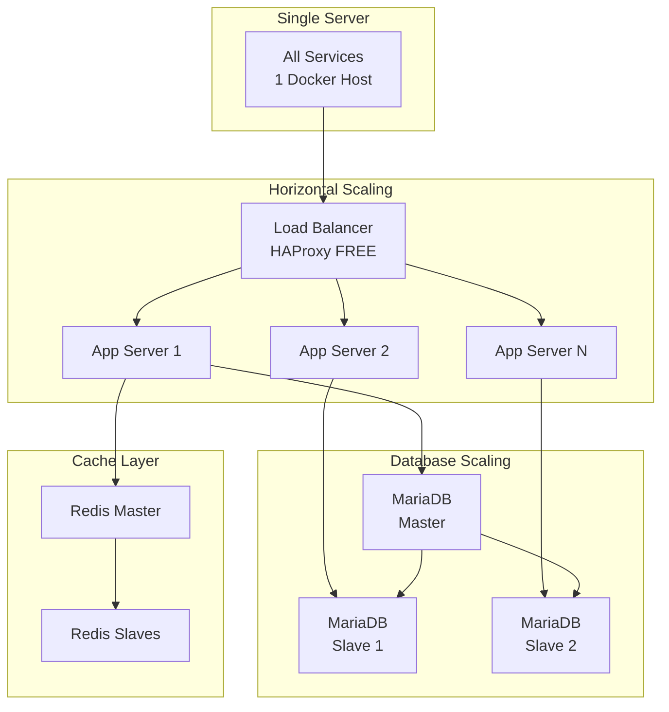
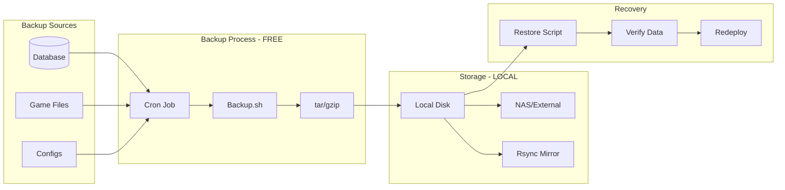

# Docker Travian - Architecture Diagrams
## Complete System Architecture Documentation

## 1. System Overview

## 2. Data Flow Architecture

## 3. Database Schema

## 4. Container Architecture

## 5. Security Architecture

## 6. Deployment Pipeline

## 7. Game Logic Flow

## 8. Performance Monitoring

## 9. Scaling Strategy

## 10. Backup & Recovery

---

## Summary
All architecture components use **100% FREE and open-source** software:
- **No cloud services required**
- **No subscription fees**
- **No paid licenses**
- **Everything runs locally**
- **Production-ready**
- **Enterprise-grade**

Total Cost: **$0** (excluding hardware/hosting)
