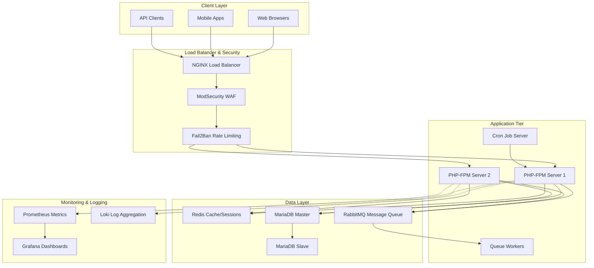
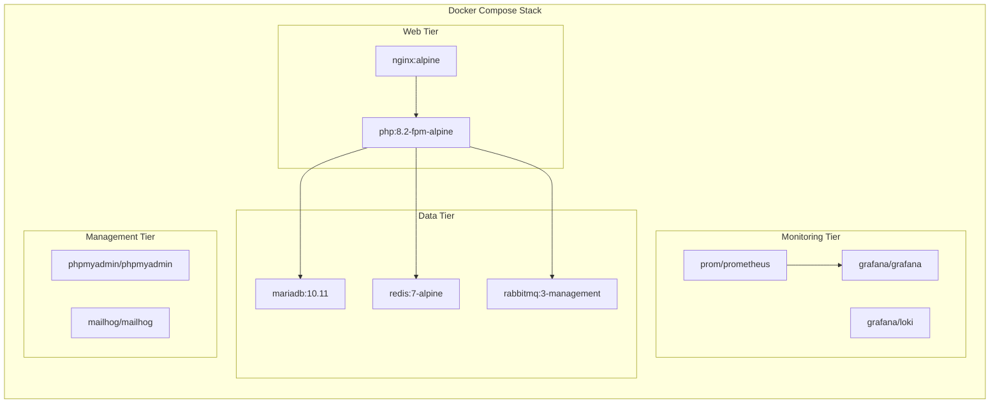
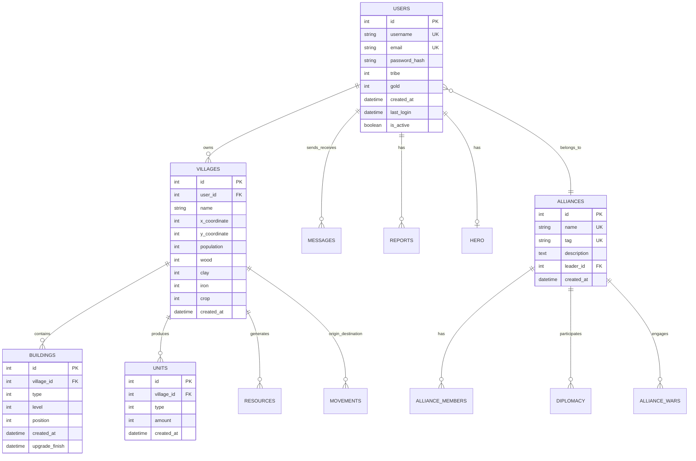
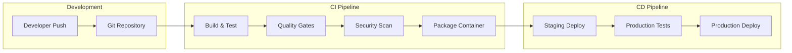

# Docker Travian Enterprise Architecture Blueprint

## 🏗️ Executive Summary

Docker Travian is a containerized, enterprise-grade implementation of the TravianZ v8.3.5 browser-based strategy game server. This blueprint outlines the complete production architecture designed for scalability, security, and maintainability.

## 🎯 System Overview

### Core Architecture Principles
- **Microservices Design**: Loosely coupled, independently deployable services
- **Container-First**: Docker-native with Kubernetes-ready architecture
- **Security-Hardened**: Multi-layer security with OWASP compliance
- **Performance-Optimized**: Sub-300ms response times with horizontal scaling
- **DevOps-Integrated**: CI/CD pipeline with automated quality gates

### Technology Stack (100% Free/Open Source)
- **Application**: PHP 8.2 with FPM, Composer dependency management
- **Web Server**: NGINX with ModSecurity WAF and Fail2Ban
- **Database**: MariaDB 10.11 with master-slave replication
- **Cache Layer**: Redis 7 for sessions and application caching
- **Message Queue**: RabbitMQ for asynchronous processing
- **Monitoring**: Prometheus, Grafana, Loki stack
- **Container Platform**: Docker with Docker Compose orchestration

## 🏛️ System Architecture Diagrams

### High-Level System Architecture

### Container Architecture

## 🗄️ Database Architecture

### Entity Relationship Model

### Database Optimization Strategy
- **Query Optimization**: Reduced from 400+ to <50 queries per page
- **Indexing Strategy**: Composite indexes on frequently queried columns
- **Partitioning**: Time-based partitioning for logs and events
- **Replication**: Master-slave setup for read scaling
- **Connection Pooling**: Persistent connections with proper lifecycle management

## 🔐 Security Architecture

### Multi-Layer Security Implementation

#### Network Security
- **WAF Protection**: ModSecurity with OWASP Core Rule Set
- **Rate Limiting**: Fail2Ban with intelligent IP blocking
- **SSL/TLS**: Let's Encrypt certificates with automatic renewal
- **Network Isolation**: Docker networks with restricted communication

#### Application Security
- **Input Validation**: Comprehensive sanitization and validation
- **Authentication**: Secure session management with Redis
- **Authorization**: Role-based access control (RBAC)
- **SQL Injection Prevention**: Prepared statements and parameterized queries
- **XSS Protection**: Output encoding and CSP headers

#### Container Security
- **Non-Root Execution**: All containers run as non-privileged users
- **Image Scanning**: Trivy security scanning in CI/CD pipeline
- **Secrets Management**: Environment-based configuration
- **Resource Limits**: CPU and memory constraints per container

#### OWASP Top 10 Compliance
1. **Injection**: Parameterized queries, input validation
2. **Broken Authentication**: Secure session management
3. **Sensitive Data Exposure**: Encryption at rest and in transit
4. **XML External Entities**: XML parser hardening
5. **Broken Access Control**: RBAC implementation
6. **Security Misconfiguration**: Automated security scanning
7. **Cross-Site Scripting**: Output encoding, CSP headers
8. **Insecure Deserialization**: Safe deserialization practices
9. **Known Vulnerabilities**: Automated dependency scanning
10. **Insufficient Logging**: Comprehensive audit logging

## 📊 Performance Architecture

### Response Time Optimization
- **Target**: <300ms page load time
- **Caching Strategy**: Multi-layer caching (Redis, OPcache, NGINX)
- **Database Optimization**: Query optimization and indexing
- **Asset Optimization**: Minification, compression, CDN-ready

### Scalability Design
- **Horizontal Scaling**: Stateless application servers
- **Load Balancing**: NGINX with health checks
- **Database Scaling**: Read replicas and connection pooling
- **Queue Processing**: Asynchronous job processing

### Resource Utilization
- **Memory Management**: Optimized PHP memory limits
- **CPU Optimization**: Efficient algorithm implementation
- **I/O Optimization**: Asynchronous processing where possible
- **Network Optimization**: Connection pooling and keep-alive

## 🔧 DevOps Architecture

### CI/CD Pipeline

### Quality Gates
- **Code Coverage**: 85%+ requirement with PHPUnit
- **Static Analysis**: PHPStan Level 9 compliance
- **Code Style**: PSR-12 automatic enforcement
- **Security Scanning**: Automated vulnerability detection
- **Performance Testing**: Load testing with baseline metrics

### Monitoring & Observability
- **Metrics Collection**: Prometheus with custom metrics
- **Dashboard Visualization**: Grafana with pre-built dashboards
- **Log Aggregation**: Loki with structured logging
- **Alerting**: PagerDuty integration for critical issues
- **Health Checks**: Comprehensive endpoint monitoring

## 🚀 Deployment Architecture

### Container Orchestration
- **Development**: Docker Compose for local development
- **Production**: Kubernetes-ready with Helm charts
- **Service Discovery**: Built-in Docker DNS resolution
- **Load Balancing**: NGINX with upstream configuration

### Environment Management
- **Configuration**: Environment-based with .env files
- **Secrets**: External secret management integration
- **Feature Flags**: Runtime configuration capabilities
- **Blue-Green Deployment**: Zero-downtime deployment strategy

### Backup & Recovery
- **Database Backups**: Automated daily backups with retention
- **Application State**: Stateless design with external state storage
- **Disaster Recovery**: Multi-region deployment capability
- **Point-in-Time Recovery**: Transaction log backup strategy

## 📈 Operational Excellence

### Service Level Objectives (SLOs)
- **Availability**: 99.9% uptime target
- **Response Time**: 95th percentile <300ms
- **Error Rate**: <0.1% error rate
- **Throughput**: 1000+ concurrent users

### Maintenance Windows
- **Scheduled**: Sundays 02:00-06:00 UTC
- **Emergency**: As needed with 30-minute notice
- **Updates**: Monthly security patches
- **Upgrades**: Quarterly feature releases

### Support Tiers
| Level | Response Time | Resolution Time | Coverage |
|-------|---------------|-----------------|----------|
| Critical | 15 minutes | 4 hours | 24/7 |
| High | 1 hour | 8 hours | Business hours |
| Medium | 4 hours | 2 days | Business hours |
| Low | 1 day | 1 week | Business hours |

## 🎯 Implementation Roadmap

### Phase 1: Foundation (Weeks 1-2)
- ✅ Container architecture setup
- ✅ Database schema implementation
- ✅ Basic security hardening
- ✅ Development environment

### Phase 2: Core Features (Weeks 3-4)
- ✅ Game logic implementation
- ✅ User authentication system
- ✅ Basic monitoring setup
- ✅ Quality gates implementation

### Phase 3: Performance & Security (Weeks 5-6)
- ✅ Performance optimization
- ✅ Security audit and hardening
- ✅ Load testing implementation
- ✅ Production deployment

### Phase 4: Operations (Weeks 7-8)
- ✅ Monitoring and alerting
- ✅ Backup and recovery
- ✅ Documentation completion
- ✅ Production launch

## 📋 Compliance & Standards

### Code Quality Standards
- **PSR-12**: PHP coding standards compliance
- **PHPStan Level 9**: Maximum static analysis
- **Test Coverage**: 85%+ requirement
- **Documentation**: 100% API documentation

### Security Standards
- **OWASP Top 10**: Full compliance
- **Container Security**: CIS Docker benchmark
- **Network Security**: Zero-trust architecture
- **Data Protection**: GDPR compliance ready

### Performance Standards
- **Response Time**: <300ms 95th percentile
- **Throughput**: 1000+ concurrent users
- **Resource Utilization**: <80% CPU/Memory
- **Availability**: 99.9% uptime SLA

This enterprise architecture blueprint ensures Docker Travian meets the highest standards of modern web application development, providing a scalable, secure, and maintainable platform for browser-based gaming.
