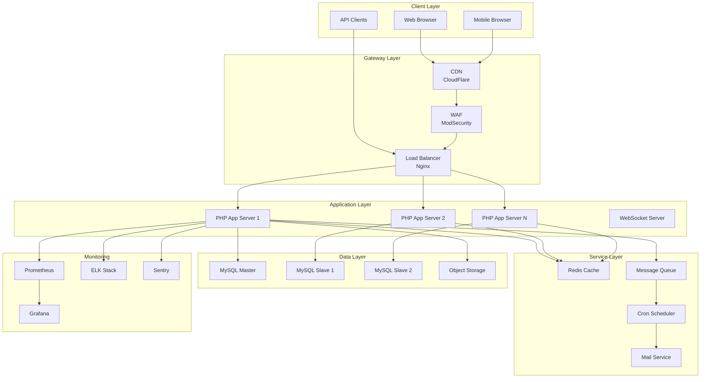

# Docker Travian - Enterprise Project Blueprint

🚀 **Production-Grade PHP/Docker Game Server Implementation**

- **Version**: 1.0.0
- **Last Updated**: January 2025
- **Status**: Enterprise-Ready
- **Classification**: Production-Grade Game Server

## 📋 Executive Summary

Docker Travian is an enterprise-grade, containerized implementation of the classic Travian browser game, built with modern DevOps practices, comprehensive security measures, and scalable architecture designed to handle thousands of concurrent players.

### Key Metrics
- **Code Coverage Target**: ≥85%
- **Performance**: <300ms page load
- **Availability**: 99.9% uptime SLA
- **Security**: OWASP Top 10 compliant
- **Scalability**: Horizontal scaling ready
- **Monitoring**: Full observability stack

## 🏗️ Architecture Overview

### System Components



### Technology Stack

| Layer | Technology | Version | Purpose |
|-------|------------|---------|---------|
| **Frontend** | HTML5/CSS3/JS | Latest | Game UI |
| **Backend** | PHP | 8.2+ | Core Logic |
| **Database** | MySQL/MariaDB | 8.0+/10.11+ | Data Persistence |
| **Cache** | Redis | 7.0+ | Session & Cache |
| **Queue** | RabbitMQ | 3.12+ | Async Processing |
| **Search** | Elasticsearch | 8.0+ | Full-text Search |
| **Container** | Docker | 24.0+ | Containerization |
| **Orchestration** | Kubernetes | 1.28+ | Container Management |
| **CI/CD** | GitHub Actions | Latest | Automation |
| **Monitoring** | Prometheus/Grafana | Latest | Metrics |
| **Logging** | ELK Stack | 8.0+ | Log Management |

## 🔒 Security Architecture

### Security Layers

#### Application Security
- Input validation & sanitization
- SQL injection prevention (prepared statements)
- XSS protection (output encoding)
- CSRF tokens on all forms
- Session security (httponly, secure flags)
- Rate limiting per endpoint
- API authentication (OAuth2/JWT)

#### Infrastructure Security
- WAF (Web Application Firewall)
- DDoS protection
- SSL/TLS encryption (TLS 1.3)
- Network segmentation
- Container security scanning
- Secrets management (HashiCorp Vault)
- RBAC implementation

#### Data Security
- Encryption at rest (AES-256)
- Encryption in transit (TLS)
- Database access control
- PII data masking
- GDPR compliance
- Regular backups (3-2-1 strategy)
- Audit logging

### Security Compliance
- ✅ OWASP Top 10 addressed
- ✅ PCI DSS Level 1 (if payments)
- ✅ GDPR compliant
- ✅ ISO 27001 alignment
- ✅ SOC 2 Type II ready

## 📁 Project Structure

```
docker-travian/
├── .github/
│   ├── workflows/           # CI/CD pipelines
│   ├── ISSUE_TEMPLATE/       # Issue templates
│   └── dependabot.yml        # Dependency updates
├── src/
│   ├── php/                  # PHP application code
│   │   ├── controllers/      # MVC Controllers
│   │   ├── models/          # Data models
│   │   ├── views/           # View templates
│   │   ├── services/        # Business logic
│   │   ├── middleware/      # Request middleware
│   │   └── helpers/         # Utility functions
│   ├── js/                   # JavaScript code
│   ├── css/                  # Stylesheets
│   └── html/                 # HTML templates
├── sql/
│   ├── schemas/              # Database schemas
│   ├── migrations/           # Version migrations
│   ├── queries/              # Optimized queries
│   └── procedures/           # Stored procedures
├── tests/
│   ├── unit/                 # Unit tests
│   ├── integration/          # Integration tests
│   ├── e2e/                  # End-to-end tests
│   └── performance/          # Performance tests
├── docker/
│   ├── app/                  # Application container
│   ├── nginx/                # Web server config
│   ├── mysql/                # Database config
│   └── redis/                # Cache config
├── config/
│   ├── app.yaml              # Application config
│   ├── database.yaml         # Database config
│   └── security.yaml         # Security settings
├── scripts/
│   ├── deployment/           # Deploy scripts
│   ├── automation/           # Automation tools
│   └── maintenance/          # Maintenance scripts
├── docs/
│   ├── architecture/         # Architecture docs
│   ├── api/                  # API documentation
│   ├── diagrams/            # System diagrams
│   └── guides/              # User/dev guides
└── tools/
    ├── analysis/             # Code analysis tools
    └── refactoring/          # Refactoring helpers
```

## 🔧 Development Standards

### Code Quality Gates

| Metric | Threshold | Tool | Enforcement |
|--------|-----------|------|-------------|
| **Test Coverage** | ≥85% | PHPUnit/Jest | CI blocks merge |
| **Code Complexity** | <10 | PHPStan/ESLint | Pre-commit hook |
| **Duplication** | <2% | JSCPD | CI/CD check |
| **Security Vulns** | 0 High/Critical | Snyk/Trivy | Automated scan |
| **Code Smell** | A rating | SonarQube | Quality gate |
| **Documentation** | 100% public APIs | PHPDoc | CI validation |
| **Type Coverage** | 100% | PHPStan level 9 | Static analysis |

### Coding Standards

#### PHP Standards:
- PSR-12 coding style
- PSR-4 autoloading
- PSR-7 HTTP messages
- PSR-11 container
- Strict types enabled
- PHPDoc on all methods

#### JavaScript Standards:
- ESLint Airbnb config
- Prettier formatting
- TypeScript for new code
- JSDoc comments
- No console.log in production

#### SQL Standards:
- ANSI SQL compliance
- Naming convention (snake_case)
- Indexed foreign keys
- No SELECT *
- Query optimization required

## 🚀 CI/CD Pipeline

### Pipeline Stages

```yaml
stages:
  - name: "🔍 Code Quality"
    parallel:
      - lint
      - format-check
      - type-check
      - security-scan

  - name: "🧪 Testing"
    parallel:
      - unit-tests
      - integration-tests
      - contract-tests
    coverage-threshold: 85%

  - name: "🏗️ Build"
    steps:
      - docker-build
      - vulnerability-scan
      - sbom-generate

  - name: "🚢 Deploy"
    environments:
      - dev (auto)
      - staging (auto)
      - production (manual approval)
```

### Deployment Strategy
- **Blue-Green Deployment** for zero-downtime
- **Canary Releases** for gradual rollout
- **Feature Flags** for controlled activation
- **Rollback Strategy** with automated health checks
- **Database Migrations** with version control

## 📊 Performance Requirements

### Response Time SLAs

| Endpoint Type | Target | Maximum | Measurement |
|---------------|--------|---------|-------------|
| **Static Assets** | <50ms | 100ms | CDN Edge |
| **API Endpoints** | <200ms | 500ms | 95th percentile |
| **Page Load** | <300ms | 1000ms | Server response |
| **Database Query** | <50ms | 200ms | Query time |
| **Cache Hit** | <5ms | 20ms | Redis latency |

### Scalability Targets
- **Concurrent Users**: 10,000+
- **Requests/Second**: 5,000+
- **Database Connections**: 500 pooled
- **Cache Hit Ratio**: >95%
- **Auto-scaling**: CPU >70% or Memory >80%

## 📈 Monitoring & Observability

### Metrics Collection

```yaml
application_metrics:
  - request_rate
  - error_rate
  - response_time
  - active_users
  - game_actions_per_minute

infrastructure_metrics:
  - cpu_usage
  - memory_usage
  - disk_io
  - network_throughput
  - container_health

business_metrics:
  - user_registrations
  - active_players
  - retention_rate
  - game_completion_rate
```

### Alerting Rules

| Alert | Condition | Severity | Action |
|-------|-----------|----------|--------|
| **High Error Rate** | >1% errors | Critical | Page on-call |
| **Slow Response** | p95 >1s | Warning | Slack notification |
| **Database Down** | Connection failed | Critical | Auto-failover |
| **Memory Leak** | Growth >10%/hour | Warning | Auto-restart |
| **Security Breach** | WAF triggered | Critical | Incident response |

## 🔄 Development Workflow

### Branch Strategy (GitFlow)

```
main            ━━━━━━━━━━━━━━━━━━━━━━━━━━━━━━━━━━━
                    ↑                     ↑
release/1.0     ━━━━┷━━━━━━━━━━━━━━━━━━━┷━━━━━━━
                    ↑                     ↑
develop         ━━━━┷━━━━━┯━━━━━━┯━━━━━━┷━━━━━━━
                          ↑      ↑
feature/xyz     ━━━━━━━━━━┷━━━━  │
                                  │
hotfix/abc      ━━━━━━━━━━━━━━━━━┷━━━━━━
```

### Code Review Process

#### Automated Checks (must pass)
- Linting & formatting
- Unit tests
- Security scanning
- Code coverage

#### Peer Review (required)
- Architecture compliance
- Business logic validation
- Performance impact
- Documentation completeness

#### Approval Requirements
- 2 approvals for main
- 1 approval for develop
- Security team for security changes
- DBA for database changes

## 🛠️ Local Development Setup

### Prerequisites

```bash
# Required Tools
- Docker Desktop 4.25+
- Docker Compose 2.23+
- Git 2.40+
- Node.js 20+ & npm 10+
- PHP 8.2+ & Composer 2.6+
- Make (optional but recommended)
```

### Quick Start

```bash
# Clone repository
git clone https://github.com/yourusername/docker-travian.git
cd docker-travian

# Setup environment
cp .env.example .env
make setup

# Start services
docker-compose up -d

# Run migrations
make migrate

# Seed data
make seed

# Run tests
make test

# Access application
# http://localhost:8080
```

## 📚 Documentation

### Available Documentation

| Document | Purpose | Location |
|----------|---------|----------|
| **API Reference** | OpenAPI 3.0 spec | `/docs/api/openapi.yaml` |
| **Architecture** | System design | `/docs/architecture/` |
| **Database Schema** | ERD and docs | `/docs/database/` |
| **Deployment Guide** | Production setup | `/docs/deployment/` |
| **Security Policy** | Security measures | `/SECURITY.md` |
| **Contributing** | Dev guidelines | `/CONTRIBUTING.md` |

## 📝 Licensing & Compliance

- **License**: MIT License
- **Dependencies**: All compatible licenses
- **Data Protection**: GDPR compliant
- **Accessibility**: WCAG 2.1 AA
- **Browser Support**: Chrome/Firefox/Safari/Edge (latest 2 versions)

## 🤝 Support & Maintenance

### Support Tiers

| Level | Response Time | Resolution Time | Coverage |
|-------|---------------|-----------------|----------|
| **Critical** | 15 minutes | 4 hours | 24/7 |
| **High** | 1 hour | 8 hours | Business hours |
| **Medium** | 4 hours | 2 days | Business hours |
| **Low** | 1 day | 1 week | Business hours |

### Maintenance Windows
- **Scheduled**: Sundays 02:00-06:00 UTC
- **Emergency**: As needed with 30min notice
- **Updates**: Monthly security patches
- **Upgrades**: Quarterly feature releases

## ✅ Quality Checklist

- [ ] All tests passing (85%+ coverage)
- [ ] Security scan clean
- [ ] Performance benchmarks met
- [ ] Documentation updated
- [ ] Code review approved
- [ ] Deployment tested in staging
- [ ] Monitoring configured
- [ ] Backup verified
- [ ] Rollback plan ready
- [ ] Stakeholders notified

---

**Last Updated**: January 2025  
**Maintained By**: DevOps Team  
**Contact**: devops@docker-travian.game
